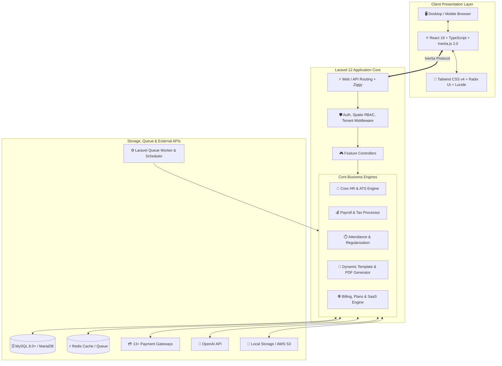

<div align="center">

# ⚡ HRM & HRM SaaS
### Next-Generation Human Resource Management & Multi-Tenant SaaS Platform

[](https://laravel.com)
[](https://react.dev)
[](https://www.typescriptlang.org)
[](https://inertiajs.com)
[](https://tailwindcss.com)
[](https://www.php.net)
[](https://vitejs.dev)
[](LICENSE)

<p align="center">
  <b>An enterprise-grade, high-performance Human Resource Management System with seamless dual-mode capability: run as an all-in-one Single Company HR Hub or scale into a fully monetizable Multi-Tenant SaaS Platform.</b>
</p>

[✨ Key Features](#-key-features) •
[🏗️ Architecture](#️-system-architecture) •
[💻 Tech Stack](#-technology-stack) •
[🚀 Quick Start](#-installation--quick-start) •
[🔑 Credentials](#-default-credentials) •
[💳 Payment Gateways](#-payment-gateways--integrations) •
[🌐 Multi-Language](#-localization--i18n) •
[🛠️ Troubleshooting](#️-troubleshooting--faqs)

---

</div>

## 🌟 Executive Overview

**HRM SaaS** bridges the gap between modern corporate HR operations and multi-tenant software-as-a-service architecture. Engineered with **Laravel 12**, **Inertia.js 2.0**, and **React 19**, it delivers a blazing-fast single-page app experience (SPA) with server-side simplicity and ironclad security.

```
┌───────────────────────────────────────────────────────────────────────────────────┐
│                                DUAL RUNTIME MODES                                 │
├────────────────────────────────────────┬──────────────────────────────────────────┤
│ 🏢 Standalone HRM Mode                 │ 🌐 Multi-Tenant SaaS Platform            │
│  • Single-company dedicated deployment │  • Multi-company SaaS subscriptions      │
│  • Direct Company Admin control        │  • Super Admin & Billing Control Center  │
│  • Zero subscription overhead          │  • 13+ Payment Gateways, Coupons & Plans │
│  • Ideal for private organizations     │  • Public Landing Page & CMS Builder     │
└────────────────────────────────────────┴──────────────────────────────────────────┘
```

---

## ✨ Key Features

### 🏢 1. Core HR & Employee Lifecycle
- **Employee Directory**: Rich employee profiles, emergency contacts, banking info, and document vaults.
- **Organization Hierarchy**: Multi-branch support, dynamic departments, and designation trees.
- **Lifecycle Transitions**: Structured management for **Promotions**, **Transfers**, **Awards**, **Disciplinary Warnings**, **Complaints**, **Resignations**, and **Terminations**.
- **Role-Based Access Control (RBAC)**: Fine-grained permissions powered by Spatie for Super Admins, Company Admins, HR Managers, Department Heads, and Employees.

### ⏱️ 2. Attendance & Shift Scheduling
- **Flexible Clock-In / Out**: Web-based punching with device, IP, and location verification.
- **Shift Management**: Configurable day/night/split shifts, grace periods, and rotating rosters.
- **Attendance Regularization**: Employee self-service request pipeline for missed punches with approval workflows.
- **IP Restrictions**: Whitelist corporate network subnets to prevent remote punch spoofing.

### 🌴 3. Leave & Absence Management
- **Custom Leave Policies**: Annual, casual, sick, maternity, paternity, and compensatory policies.
- **Accrual & Balance Auto-Sync**: Automated recurring balance updates, carry-forward rules, and encashment.
- **Approval Workflows**: Multi-tier hierarchy reviews with real-time notifications.
- **Company Holiday Calendar**: Location-aware holidays and non-working day definitions.

### 💼 4. Recruitment & Applicant Tracking (ATS)
- **Job Requisitions & Board**: Internal hiring requisitions, external public job listings, and custom applications.
- **Kanban Candidate Pipeline**: Drag-and-drop applicants across customized recruitment stages.
- **Interview Suite**: Multi-round interview scheduling, custom assessment scoring, and interviewer feedback.
- **Automated Onboarding**: Candidate-to-employee converter with automated onboarding checklist tasks.

### 💰 5. Payroll & Compensation Engine
- **Flexible Pay Structures**: Earnings, allowances, deductions, tax brackets, and overtime multipliers.
- **One-Click Automated Pay Runs**: Batch payroll generation with automated deductions and bonuses.
- **Payslips & Reports**: Professional PDF payslip downloads, batch email dispatches, and spreadsheet exports.
- **Multi-Currency Support**: Company-level currency symbols, exchange formats, and decimal precision.

### 📈 6. Performance, OKRs & Appraisals
- **Goal & OKR Tracking**: Company-wide, departmental, and personal goal setting with progress indicators.
- **Performance Indicators (KPIs)**: Quantifiable metrics across functional categories.
- **360° Appraisal Reviews**: Self-reviews, manager evaluations, peer feedback, and cyclical ratings.

### 🎓 7. Training & Professional Development
- **Training Programs**: Structured internal and external training catalogs.
- **Session Attendance**: Real-time attendee logs and session completion records.
- **Skill Assessments**: Post-training tests, grading, and certification tracking.

### 📦 8. Asset Management & Depreciation
- **Hardware & Asset Inventory**: Tracking serial numbers, warranties, asset types, and condition states.
- **Custody & Assignments**: Digital sign-offs and assignment history logs.
- **Depreciation Calculator**: Linear/custom depreciation tracking over asset lifecycles.
- **Maintenance Schedules**: Repair logging, vendor assignment, and warranty alerts.

### 📜 9. Smart Document & Template Generator
- **Dynamic Placeholders**: WYSIWYG rich text editor with variable token interpolation (`{employee_name}`, `{salary}`, etc.).
- **Built-in Templates**: Experience Letters, NOC (No Objection Certificates), Joining Letters, and Offer Letters.
- **Digital Acknowledgments**: Require employees to review and digitally sign company policies and contracts.

### 🤝 10. Meetings, Events & Communication
- **Meeting Rooms & Scheduler**: Room booking engine, internal attendee invites, and agenda setting.
- **Minutes of Meeting (MoM)**: Action item assignment and post-meeting distribution.
- **Announcements & Broadcasts**: Targeted notifications by branch, department, or company-wide.

### 🚀 11. Multi-Tenant SaaS Engine *(When `IS_SAAS=true`)*
- **Subscription Plans**: Monthly and annual recurring packages with custom feature flags and storage limits.
- **Order Management & Invoicing**: Automatic invoice generation with tax calculations and coupon discounts.
- **Referral Program**: Multi-tier affiliate tracking with payout request thresholds.
- **Landing Page & CMS**: Integrated visual landing page customizer, testimonial blocks, FAQ manager, and custom pages.

### 🤖 12. AI-Powered Enhancements
- **OpenAI Integration**: Built-in AI prompts to assist HR with writing job descriptions, candidate screening criteria, and evaluation summaries.

---

## 🏗️ System Architecture



---

## 💻 Technology Stack

| Layer | Technologies |
| :--- | :--- |
| **Backend Framework** | [Laravel 12.x](https://laravel.com) • [PHP 8.2+](https://php.net) |
| **Frontend Framework** | [React 19.x](https://react.dev) • [TypeScript 5.7+](https://www.typescriptlang.org) |
| **SPA Bridge** | [Inertia.js 2.0](https://inertiajs.com) with Server-Side Rendering (SSR) support |
| **Styling & UI** | [Tailwind CSS v4](https://tailwindcss.com) • [Radix UI](https://www.radix-ui.com) • [Lucide Icons](https://lucide.dev) |
| **Rich Text & Charts** | [Tiptap Editor](https://tiptap.dev) • [Recharts](https://recharts.org) • [FullCalendar](https://fullcalendar.io) |
| **Database & ORM** | [MySQL 8.0+](https://www.mysql.com) / [MariaDB 10.3+](https://mariadb.org) • Eloquent ORM |
| **Permissions & Roles**| [Spatie Laravel Permission v6](https://spatie.be/docs/laravel-permission) |
| **Asset Bundler** | [Vite 6.x](https://vitejs.dev) + `@tailwindcss/vite` |
| **PDF & Documents** | [Barryvdh DomPDF](https://github.com/barryvdh/laravel-dompdf) • [PhpSpreadsheet](https://phpspreadsheet.readthedocs.io) • [PhpWord](https://phpword.readthedocs.io) |

---

## ⚙️ System Requirements

Make sure your hosting server or local development environment meets these prerequisites:

- **PHP**: `>= 8.2` (PHP 8.3 recommended)
- **Composer**: `>= 2.2`
- **Node.js**: `>= 18.x` or `>= 20.x`
- **NPM**: `>= 9.x` *(or PNPM / Yarn)*
- **Database**: MySQL `5.7+` / `8.0+` or MariaDB `10.3+`
- **Required PHP Extensions**:
  `bcmath`, `ctype`, `curl`, `dom`, `fileinfo`, `gd` *(or imagick)*, `json`, `mbstring`, `openssl`, `pcre`, `pdo_mysql`, `tokenizer`, `xml`, `zip`

---

## 🚀 Installation & Quick Start

Follow these simple steps to get your environment up and running:

### 1. Clone the Repository
```bash
git clone https://github.com/ekramasif/HRM.git
cd HRM
```

### 2. Install Dependencies
```bash
# Install PHP dependencies
composer install

# Install Frontend packages
npm install
```

> 💡 **Production Note:** Use `composer install --no-dev --optimize-autoloader` for production deployments.

---

### 3. Setup Environment File
Copy the example environment file and configure your database credentials:

**macOS / Linux:**
```bash
cp env.example .env
```

**Windows (PowerShell):**
```powershell
Copy-Item env.example .env
```

**Windows (CMD):**
```cmd
copy env.example .env
```

Now, edit `.env` with your database and environment settings:
```env
APP_NAME="HRM SaaS"
APP_ENV=local
APP_DEBUG=true
APP_URL=http://localhost:8000

# -------------------------------------------------------------
# MODE SELECTOR: true = Multi-Tenant SaaS | false = Single Company
# -------------------------------------------------------------
IS_SAAS=true
IS_DEMO=false

# -------------------------------------------------------------
# DATABASE CONNECTION
# -------------------------------------------------------------
DB_CONNECTION=mysql
DB_HOST=127.0.0.1
DB_PORT=3306
DB_DATABASE=your_database_name
DB_USERNAME=your_database_user
DB_PASSWORD=your_database_password

# -------------------------------------------------------------
# QUEUE & CACHE
# -------------------------------------------------------------
QUEUE_CONNECTION=database
CACHE_STORE=file
SESSION_DRIVER=file
```

---

### 4. Generate Key, Link Storage & Set Install Flag

```bash
# 1. Generate unique application key
php artisan key:generate

# 2. Link public storage directory
php artisan storage:link
```

Create the installation marker flag file (`storage/installed`):

```bash
# On Linux / macOS:
touch storage/installed

# On Windows PowerShell:
New-Item -ItemType File -Path storage/installed -Force

# On Windows CMD:
type nul > storage\installed
```

---

### 5. Run Database Migrations & Seeds

#### Option A: Clean Installation (Recommended for Production)
```bash
php artisan migrate --seed
```

#### Option B: Demo Installation (Preloaded with sample employees, records & stats)
1. Ensure `IS_DEMO=true` in your `.env`.
2. Run:
```bash
php artisan migrate:fresh --seed
```

---

### 6. Start Development Servers

#### All-in-One Command (Artisan + Queue + Logs + Vite):
```bash
composer run dev
```

#### Or Run Independently in Separate Terminals:
```bash
# Terminal 1: Laravel Backend
php artisan serve

# Terminal 2: Vite Dev Server (Hot Module Replacement)
npm run dev

# Terminal 3: Background Queue Worker
php artisan queue:work
```

Your application is now live at: **[http://localhost:8000](http://localhost:8000)** 🎉

---

## 🔑 Default Credentials

After running `php artisan migrate --seed`, use the following preconfigured accounts:

| Portal / Role | Email Address | Password | Description & Scope |
| :--- | :--- | :--- | :--- |
| 🛡️ **Super Admin** | `superadmin@example.com` | `password` | Available when `IS_SAAS=true`. Full SaaS platform management, plans, companies, payments, and global settings. |
| 🏢 **Company Admin** | `company@example.com` | `password` | Main organization administrator. Full control over HR, payroll, employees, departments, and workflows. |
| 🧪 **Demo Company 1** | `admin@techcorp.com` | `password` | *Seeded when `IS_DEMO=true`*. Prepopulated tech company dataset. |
| 🧪 **Demo Company 2** | `admin@digitalinnovations.com` | `password` | *Seeded when `IS_DEMO=true`*. Prepopulated creative agency dataset. |
| 🧪 **Demo Company 3** | `admin@globalsystems.com` | `password` | *Seeded when `IS_DEMO=true`*. Prepopulated enterprise dataset. |

---

## 💳 Payment Gateways & Integrations

HRM SaaS comes pre-integrated with **13+ leading payment gateways** to support subscription checkout worldwide:

| Gateway | Supported Currencies / Regions | Mode |
| :--- | :--- | :--- |
| **Stripe** | 135+ Currencies, Global Credit/Debit Cards, Apple Pay, Google Pay | Sandbox & Live |
| **PayPal** | Global International Payments & PayPal Wallets | Sandbox & Live |
| **Razorpay** | INR, UPI, Cards, NetBanking (India) | Test & Live |
| **Cashfree** | INR, Instant UPI, NetBanking (India) | Test & Production |
| **MercadoPago** | BRL, ARS, MXN, COP, CLP (Latin America) | Sandbox & Production |
| **Mollie** | EUR, iDEAL, Bancontact, SEPA (Europe) | Test & Live |
| **Paystack** | NGN, GHS, ZAR, KES (Africa) | Test & Live |
| **CoinGate** | Bitcoin, Ethereum, USDT, 70+ Cryptocurrencies | Sandbox & Live |
| **Authorize.Net** | USD, CAD, GBP, EUR (North America / Global) | Sandbox & Live |
| **Iyzipay** | TRY, EUR, USD (Turkey) | Sandbox & Live |
| **FedaPay** | XOF, XAF, Mobile Money (West/Central Africa) | Sandbox & Live |
| **PayTabs** | SAR, AED, EGP, USD (Middle East & North Africa) | Test & Live |
| **YooMoney** *(YooKassa)* | RUB (Russia & CIS) | Test & Live |
| **Bank Transfer / Offline** | Manual payment verification with receipt attachment | Direct Approval |

---

## 🌐 Localization & i18n

HRM includes a full-featured translation and multi-language engine.

### Extracting Language Strings
To scan all React (`.tsx`, `.jsx`) and Laravel (`.php`, `.blade.php`) files for newly added translation keys:

```bash
php extract-translations.php
```

All extracted translation keys will be automatically indexed into `resources/lang/en.json`. You can clone this file to add languages like `es.json`, `fr.json`, `ar.json`, `de.json`, etc.

---

## 🚀 Production Deployment & Optimization

### 1. Optimize Laravel Cache
```bash
php artisan config:cache
php artisan route:cache
php artisan view:cache
php artisan event:cache
```

### 2. Build Production Frontend Assets
```bash
npm run build
```

### 3. Setup Linux Cron Scheduler
Add the scheduler to your crontab (`crontab -e`):
```bash
* * * * * cd /path/to/your/hrm-project && php artisan schedule:run >> /dev/null 2>&1
```

### 4. Background Queue Worker (Supervisor Configuration)
Create a Supervisor config file `/etc/supervisor/conf.d/hrm-worker.conf`:
```ini
[program:hrm-worker]
process_name=%(program_name)s_%(process_num)02d
command=php /path/to/your/hrm-project/artisan queue:work --sleep=3 --tries=3 --max-time=3600
autostart=true
autorestart=true
stopasgroup=true
killasgroup=true
user=www-data
numprocs=2
redirect_stderr=true
stdout_logfile=/path/to/your/hrm-project/storage/logs/worker.log
stopwaitsecs=3600
```

---

## 🛠️ Troubleshooting & FAQs

<details>
<summary><b>1. Images, Avatars, or Uploaded Documents Not Displaying?</b></summary>
<br>
Run the storage symlink command:

```bash
php artisan storage:link
```
Also ensure the `storage/app/public` folder has read/write permissions (`chmod -R 775 storage`).
</details>

<details>
<summary><b>2. White Screen / Global Settings Error on First Boot?</b></summary>
<br>
The application requires the empty installation flag file to load system-wide settings:

```bash
touch storage/installed
# On Windows PowerShell: New-Item -ItemType File -Path storage/installed -Force
```
</details>

<details>
<summary><b>3. How do I switch between Single-Company and SaaS Mode?</b></summary>
<br>
In your `.env` file:
- `IS_SAAS=true`: Activates the Super Admin control panel, subscription plans, billing, and multi-tenancy.
- `IS_SAAS=false`: Hides SaaS layers and turns the system into a single dedicated organization portal.

After changing, run `php artisan optimize:clear`.
</details>

<details>
<summary><b>4. How do I enable Server-Side Rendering (SSR)?</b></summary>
<br>
Run:

```bash
composer run dev:ssr
# Or:
npm run build:ssr && php artisan inertia:start-ssr
```
</details>

---

## 📁 Directory Structure

```
HRM/
├── app/
│   ├── Http/Controllers/     # API & Web Controllers
│   ├── Models/               # 110+ Eloquent Domain Models
│   ├── Services/             # Business Logic & Payment Services
│   ├── Mail/                 # Transactional Email Mailable classes
│   └── Providers/            # Application & Event Service Providers
├── config/                   # Configuration files
├── database/
│   ├── migrations/           # Database Schema Migrations
│   └── seeders/              # Role, Permission, and Demo Seeders
├── resources/
│   ├── css/                  # Tailwind CSS v4 & Theme stylesheets
│   ├── js/
│   │   ├── components/       # Radix UI & Reusable React Components
│   │   ├── layouts/          # Dashboard, SaaS & Auth Layouts
│   │   ├── pages/            # Inertia.js React View Pages
│   │   └── types/            # TypeScript Interface Definitions
│   └── views/                # Blade Templates (Root view & PDF templates)
├── routes/
│   ├── web.php               # Web & Inertia Routes
│   ├── auth.php              # Authentication Routes
│   └── console.php           # Artisan Scheduled Tasks
├── storage/                  # Generated files, caches & logs
├── extract-translations.php  # Automated i18n string extraction utility
└── vite.config.ts            # Vite & Tailwind compilation configuration
```

---

## 🤝 Contributing

Contributions, issues, and feature requests are welcome!
1. Fork the Project.
2. Create your Feature Branch (`git checkout -b feature/AmazingFeature`).
3. Commit your Changes (`git commit -m 'feat: Add some AmazingFeature'`).
4. Push to the Branch (`git push origin feature/AmazingFeature`).
5. Open a Pull Request.

---

## 📄 License

This project is licensed under the **MIT License** — see the [LICENSE](LICENSE) file for details.

<div align="center">
  <sub>Built with ❤️ using Laravel 12 & React 19</sub>
</div>